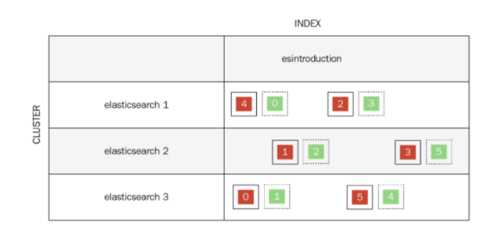

= Elastic

Все данные в Elasticsearch хранятся в Apache Lucene как инвертированный индекс.
Структура данных, в которой для каждого слова коллекции документов в соответствующем списке перечислены
все документы из коллекции, в которых оно встречалось. Инвертированный индекс используется для поиска по текстам.

Elasticsearch позволяет разделить данные на несколько машин с помощью шардов.
Есть два типа шардов — мастер и реплика.
Мастер — происходит как запись, так и чтение, он главный.
Реплика — это точная копия мастера с нее можно только читать.
В случае если мастер выходит из строя, реплика становиться мастером -
так обеспечивается обработка отказа.
Поскольку индекс распределяется по нескольким шардом,
запрос к индексу выполняется параллельно по ним. Затем результаты с каждого шарда собираются
и отправляются обратно клиенту. В результате получаем значительное повышение производительности.
Чтобы обеспечить доступность, каждый шард-реплика по умолчанию реплицируется на ноду, отличную от ноды,
где расположен шард-мастер. Это дает возможность в случае выхода из строя одного из серверов,
повысить реплики до мастеров и продолжить работу (в автоматическом режиме).



Одна из причин почему запросы в Elasticsearch работают так быстро состоит в том что они распределенные.
Несколько осколков действуют как один индекс. Поиск запроса по индексу выполняется параллельно по всем осколкам.

== Запросы поиска
=== term
```
POST example6/product/_search
{
   "query": {
     "term": {
       "product_name" : "куртк"
     }
   }
 }
```
=== terms
```
POST chapter6/_search
{
   "query": {
     "terms": {
       "product_name" : ["куртк","кожан"]
     }
   }
 }
```
=== Запрос на основе диапазона
```
select * from product where unitprice > 70 and unitprice <= 100

POST example6/_search
{
   "query": {
     "range": {
     "unit_price": {
         "gt": 70,
         "lte": 100
       }
     }
   }
 }
```
=== Запрос соответствия match
В отличие от term не нужно полное совпадение значений,
```
POST example6/product/_search
 {
   "query": {
     "match": {
       "product_name": "Куртка женская"
     }
   }
 }
```

=== Объединение разных условий bool
```
{
   "query": {
     "bool": {
       "must": [
         {
           "match": {
             "product_name": "jacket"
           }
         },
         {
           "range": {
             "unit_price": {
               "lt": "100"
             }
           }
         }
       ],
       "must_not": [...],
       "should": [...],
       "filter": [...]
     }
   }
 }
```
