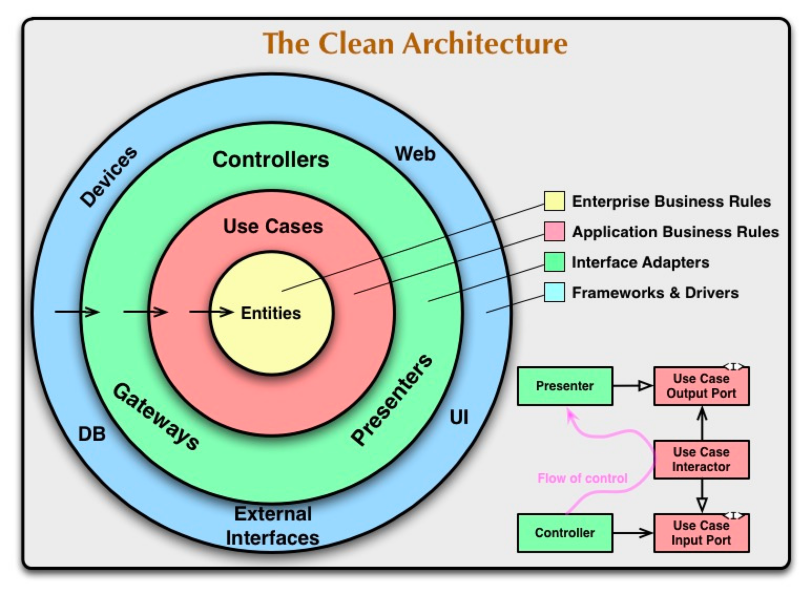
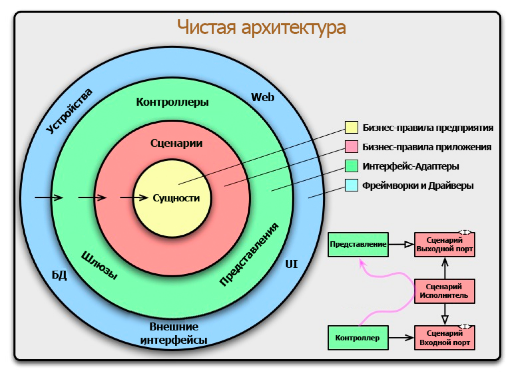

“Задача архитектуры ПО — минимизация человеческих ресурсов при разработке и последующем сопровождении системы”, — Роберт С. Мартин.

== "Порты и адаптеры"
Термин Hexagonal Architecture (гексагональная, шестиугольная архитектура) придумал в 2006 году Алистер Коберн (Alistair Cockburn).
Этот архитектурный стиль также известен как Ports And Adapters Architecture (архитектура портов и адаптеров).
Согласно этой архитектуре, с приложением взаимодействуют два типа участников: основные (driver) и вторичные (driven).
Эту архитектуру можно схематически представить в виде шестиугольника с бизнес-логикой в самом центре (в ядре),
окруженную объектами с которыми она взаимодействует, и компонентами, которые ею управляют, предоставляя входные данные.
driver'ы отправляют запросы и управляют приложением (например, пользователи, консоль или автоматизированные тесты).
driven наоборот получают команды от приложения, обеспечивают инфраструктуру для связи с внешним миром (
базы данных, очереди сообщений, поисковые движки, HTTP-клиенты) - управляются.
Поэтому можно выделить управляющие (входящие) порты и управляемые (исходящие). И соответственно, адаптеры к каждому.
Адаптеры - блоки кода, соединяющие инструменты с ядром приложения.
Порт — это спецификация того, как инструмент может использовать ядро приложения или наоборот.

== Чистая архитектура (Robert C. Martin aka Uncle Bob 2012)
Clean Architecture - набор рекомендаций (именно рекомендаций, а не строгих правил) к построению архитектуры приложения,
предложенный Робертом Мартином.
Clean Architecture объединила в себе идеи нескольких других архитектурных подходов (порты и адаптеры, луковая, кричащая),
которые сходятся в том, что архитектура должна:

* быть тестируемой;
* не зависеть от UI;
* не зависеть от БД, внешних фреймворков и библиотек.

Это достигается разделением на *слои* (рис.1 и 2) и следованием *Dependency Rule* (правилу зависимостей).

рис.1

рис.2

Согласно этому правилу, зависимости исходного кода могут быть направлены только внутрь круговой схемы.
Это правило позволяет строить системы, которые будет проще поддерживать, потому что изменения во внешних слоях не затронут внутренние слои.

*Слои*

Uncle Bob выделяет 4 слоя:

. Entities Бизнес-логика общая для многих приложений,
функции или объекты с методами, которые реализуют логику бизнеса, общую для многих приложений

. Use Cases (Interactors) Логика приложения,
описание действия, которое может совершить пользователь системы

. Interface Adapters Адаптеры между Use Cases и внешним миром:
контроллеры, Gateways (более популярное название репозитории), presenters (шаблон MVP)

. Frameworks and Drivers Самый внешний слой, тут лежит все остальное: UI, база данных, http-клиент и т.п.

*Переходы*

Переходы между слоями (на рис.1 и 2 справа снизу) осуществляются через Boundaries, то есть через два интерфейса:
один для запроса и один для ответа.
Они нужны, чтобы внутренний слой не зависел от внешнего (следуя Dependency Rule), но при этом мог передать ему данные.
Чтобы зависимость была направлена в сторону обратную потоку данных, применяется принцип инверсии зависимостей
(D из аббревиатуры SOLID).
Пример (Склад):

. контроллер (InputAdapter) зависит от интерфейса someApiService (InputPort) - черная стрелка на схеме (справа снизу на рис. 1 и 2)
. его (апи-сервис) реализует соответствующая имплементация (в которой ниже используется наш use case) - белая стрелка
. слой use case зависит от интерфейса dao (OutputPort, интерфейс репозитория) - черная стрелка
. имплементация someDaoImpl (OutputPort) естественно зависит от самого интерфейса dao - белая стрелка

Принцип инверсии зависимостей гласит, что:
«Модули высокого уровня не должны зависеть от модулей низкого уровня. Оба должны зависеть от абстракций (например, интерфейсов) ».
«Абстракции не должны зависеть от деталей. Детали (конкретные реализации) должны зависеть от абстракций ».