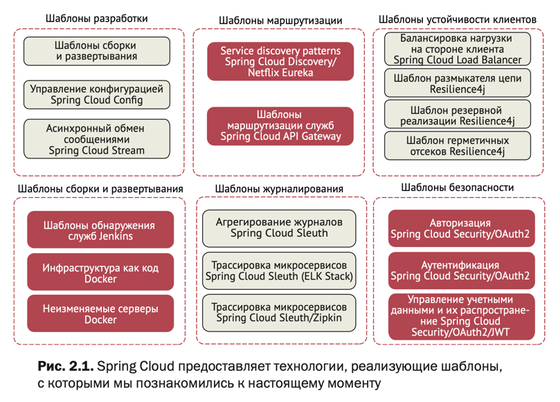

= Spring Cloud

Spring Cloud — это модуль Spring, объединяющий различный инструментарий для удобства разработки микросервисной архитектуры
с минимальной конфигурацией.
Как только мы разделяем монолит на множество микросервисов — мы получаем сложную распределённую систему
(вместо предсказуемой и понятной монолитной). У нас появляются проблемы, о которых мы до этого даже не думали (в том числе инфраструктура). Чем более распределена система, тем больше в ней мест, где может произойти сбой.
И spring cloud предоставляет набор зависимостей/модулей/фреймворков, помогающих решать эти проблемы, облегчить процесс обслуживания распределенной системы.

== Spring Cloud Sleuth (трассировка)
Добавляет уникальный id трассировки в логи, с помощью которого можно проводить диагностику, отслеживая выполнение запросов в системе, в том числе обращение к сторонним сервисам. Кроме того, есть возможность экспорта логов в инструмент агрегирования и визуализации (ELK Stack, Zipkin).
traceId — ID, назначаемый каждому запросу,
spanId — используется для отслеживания "работы", каждый запрос может иметь несколько шагов и каждый шаг имеет свой уникальный spanId.

== Spring Cloud Consul (service discovery)
Микросервисам необходимо взаимодействовать друг с другом, поэтому необходим
механизм, который бы позволил клиенту отправлять запросы на динамически изменяемый набор экземпляров (с динамическими ip) другого микросервиса.
Для этого и задействуют Consul. Consul — это децентрализованный отказоустойчивый discovery-сервис
(т.е Consul agent устанавливается на каждый хост и является полноправным участником кластера),
механизм для регистрации и мониторинга доступности и обнаружения компонентов.

Например, существует паттерн Server-Side Service Discovery, согласно которому
для отправки запроса в другой микросервис необходимо отправить запрос на маршрутизатор (еще называют балансировщиком),
в свою очередь маршрутизатор получает список экземпляров целевого микросервиса из Service Registry (Consul) и запрос перенаправится на один из экземпляров. Service Registry может сам выступать в роли маршрутизатора, например, у нас Consul выступает в роли DNS сервера, благодаря чему мы можем обращаться к микросервисам по адресам вида dev.service.cdek.tech.
Достоинства:
Не требуется дополнительный код в приложениях;
Недостатки:
Маршрутизатор является дополнительным компонентом системы, который необходимо поддерживать.
Кроме этого компонент должен быть отказоустойчивым;
Появляется дополнительное звено в цепочке сетевых вызовов.

== Spring Cloud Streams (асинхронное взаимодействие)
Фреймворк, который обеспечивает легкую интеграцию с различными брокерами сообщений
с минимальной конфигурацией. Это помогает в обмене сообщениями между микросервисами.
Легко интегрируется с RabbitMQ, Kafka.
Программная модель состоит из:

. Destination Binders (компонент, отвечающий за интеграцию с брокером),
. Bindings (создание моста между внешней системой сообщений - очереди/топики -
и Producers/Consumers (MessageChannel/SubscribableChannel) приложения: @EnableBinding({OutputStream.class, InputStream.class}), @Output/@Input),
. Messages

@StreamListener навешиваем на обработчик сообщений (можно также добавлять условия "target = MyProcessor.INPUT,
condition = "payload >= 10"), на producer можно навесить @SendTo либо MessageChannel.send().

У нас есть библиотека messaging.
