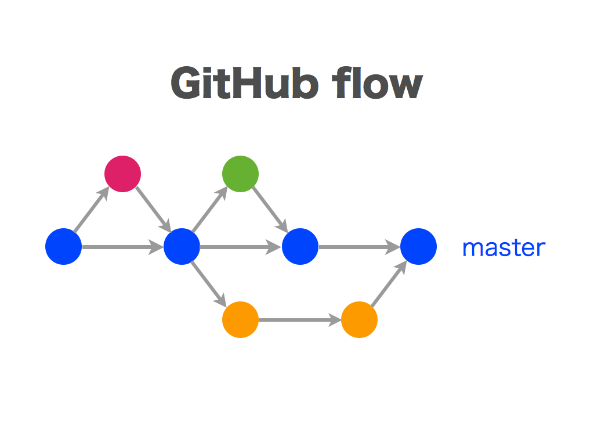

== Git Flow

== GitHub Flow

== GitLab Flow
Gitlab flow так же как и Github flow нацелен на стабилизацию ветки master и выделение от нее тематических короткоживущих веток. Однако, master не является конечной веткой для доставки ПО/кода клиентам, master в контексте Gitlab flow является веткой свободной для вливания тематических веток, от которой код пойдет дальше (по пути релиза/доставки клиентам).

image::gitlab-flow-environment-branches.png[width=500]
image::gitlab-flow-release-branches.png[width=500]

Примечание: +
Pull request (GitHub) == merge request (GitLab)